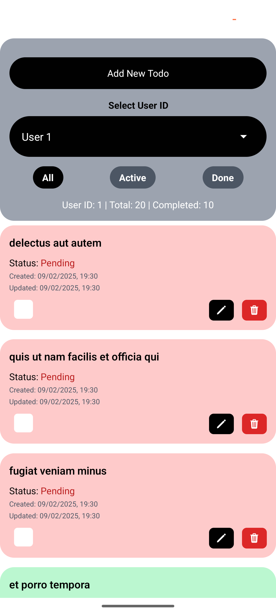
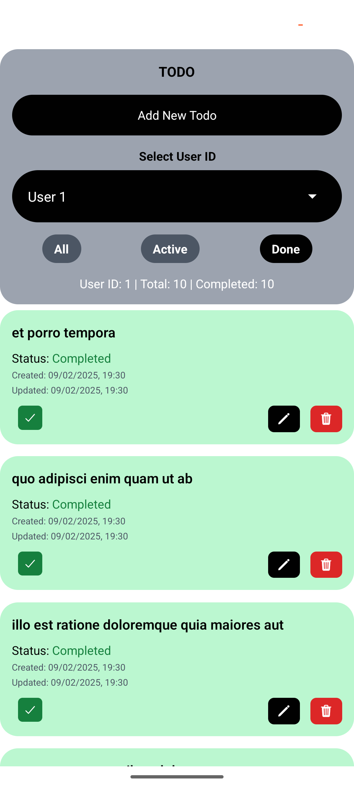
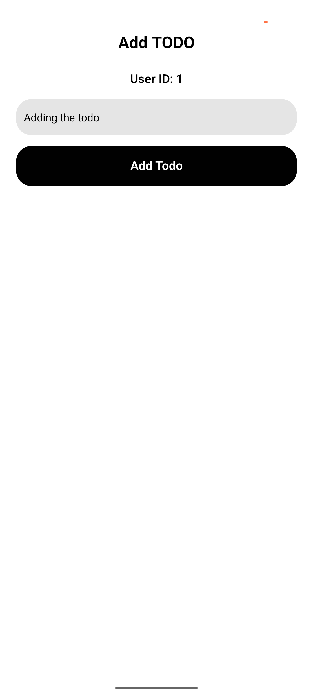

## TODO Application (Expo + React Native)

Modern, fast, and offline-ready TODO app built with Expo. It seeds read-only data from `jsonplaceholder.typicode.com/todos`, persists locally with AsyncStorage, and supports adding, editing, deleting, filtering, and animated completion toggles.

### ✨ Features
- **Seed from API, then work offline**: First run fetches todos and stores them locally; subsequent runs load from device storage.
- **Add / Edit / Delete**: Create new tasks, edit existing titles, and remove tasks.
- **Completion with animation**: Checkbox tick animates and card color transitions with Reanimated.
- **Timestamps**: `created_at` and `updated_at` are tracked and displayed (date + HH:mm).
- **Filtering & user scope**: Filter by status (All / Active / Done) and by selected `userId`.

### 🛠️ Tech Stack
- **Framework**: Expo 53, React Native 0.79, React 19
- **Navigation**: `expo-router` (file-based routing)
- **State**: Redux Toolkit + React Redux
- **Persistence**: `@react-native-async-storage/async-storage`
- **Styling**: Tailwind via `nativewind`
- **Animation**: `react-native-reanimated`
- **Networking**: Fetch API (seed from `jsonplaceholder`)

### 📁 Project structure
```text
app/
  _layout.tsx                # Root stack with router
  (stack)/
    _layout.tsx              # Redux Provider + screens
    main.tsx                 # List, filtering, toggle, actions
    add-todo.tsx             # Add / Edit form
  api/
    todosApi.tsx             # Read-only fetch from jsonplaceholder
  components/
    taskCard.tsx             # Task UI with animated checkbox
    filerCard.tsx            # Filters, user selector, stats, CTA
  store/
    index.tsx                # Configure store
    todoSlice.tsx            # State, reducers, thunks (load/seed/add/toggle/update/delete)
    todosStorage.ts          # AsyncStorage helpers
  global.css                 # Tailwind setup
```

### 🚀 Getting started
1) Install dependencies
```bash
npm install
```

2) Start the Metro server
```bash
npx expo start
```

3) Run on your target
- iOS Simulator: press `i`
- Android Emulator: press `a`
- Web: press `w`
- Device: scan QR with Expo Go

### 🔧 Scripts
- `npm run start` – Start dev server
- `npm run ios` / `npm run android` / `npm run web` – Platform targets
- `npm run lint` – Lint

### 🧭 Key flows
- **Initial load**: Try loading todos from AsyncStorage; if none, fetch from API, enrich with timestamps, then persist.
- **Add Todo**: From main screen, tap Add → enter title → persist to storage → return to list.
- **Edit Todo**: Tap edit on a card → navigates to form pre-filled → update title → persist.
- **Delete Todo**: Tap delete on a card → remove and persist.
- **Toggle Complete**: Tap checkbox → animates checkmark and card color → persist updated state.

### 🎨 UI/UX details
- Tailwind classes for rapid styling with `nativewind`.
- Reanimated for a smooth tick scale-in and ripple-like background transition.
- Date display uses device locale with date + hour:minute.

### 📸 Screenshots / Demo




